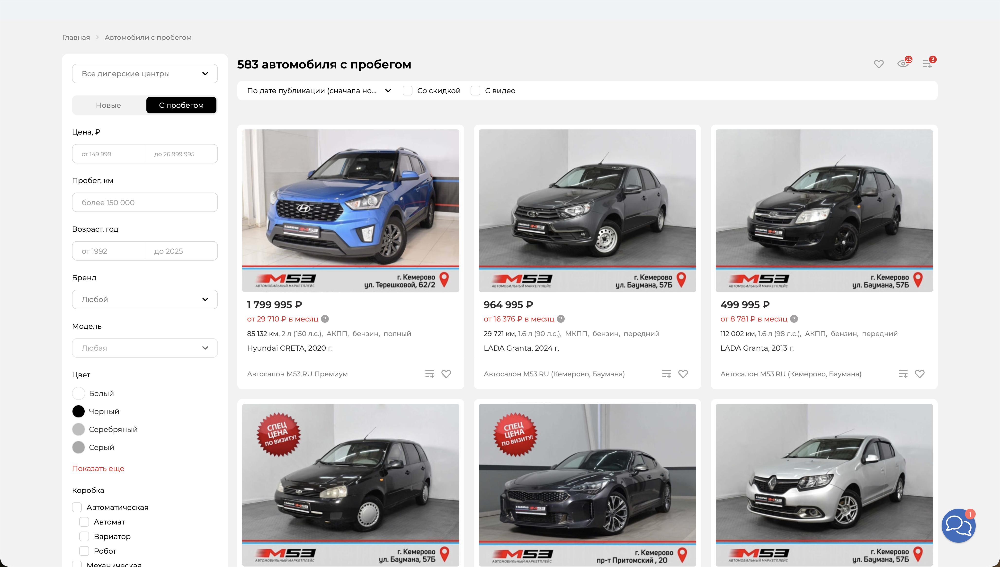
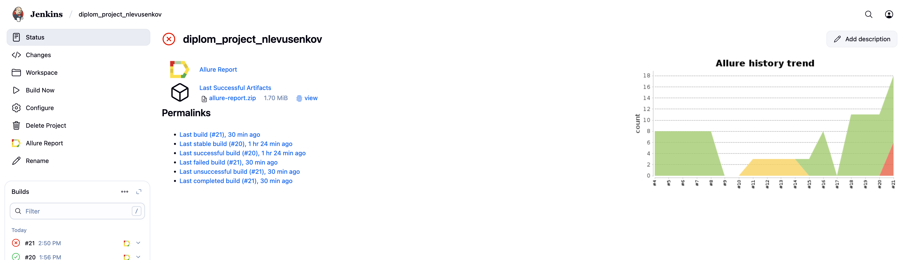

# Дипломный проект по автоматизации тестирования

## Проект по тестированию web приложения витрина автомобилей <a target="_blank" href="https://m53.ru/buy-cars">m53.ru</a>

---

### Список проверок, реализованных в web автотестах

1. Проверка 404 страницы
2. Добавление авто в избранное
3. Проверка опций автомобиля
4. Проверка базовой информации авто
5. Очистка просмотренных авто
6. Прохождение онлайн оценки по гос номеру
7. Отправка заявки на обратный звонок

---

## Проект по тестированию API <a target="_blank" href="https://reqres.in/api">reqres.in</a>

### Список проверок, реализованных в API автотестах

1. Создание пользователя
2. Удаление пользователя
3. Отображение листа пользователей
4. Авторизация
5. Успешная регистрация
6. Неуспешная регистрация
7. Обновление пользователя

---

## Проект по тестированию мобильного приложения Wikipedia

### Список проверок, реализованных в мобильных автотестах

1. Проверки приветственных страниц Wikipedia
2. Проверка текста онбординг скрина
3. Проверка поиска статьи

---

### Используемые инструменты

          

---

### Запуск автотестов осуществляется с использованием Jenkins
> [Ссылка на сборку в Jenkins](https://jenkins.autotests.cloud/job/diplom_project_nlevusenkov/)

#### Для запуска автотестов в Jenkins
1. Открыть [задачу в Jenkins](https://jenkins.autotests.cloud/job/diplom_project_nlevusenkov/)

2. Нажать "**Build Now**".

---

### Allure отчет

#### Общие результаты

> тут должен быть скрин

